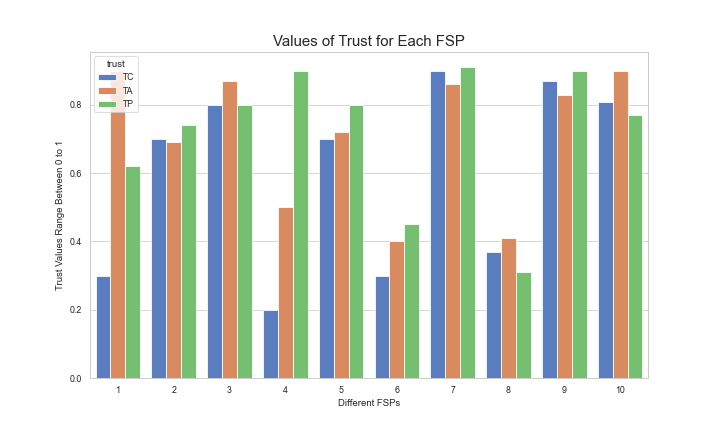
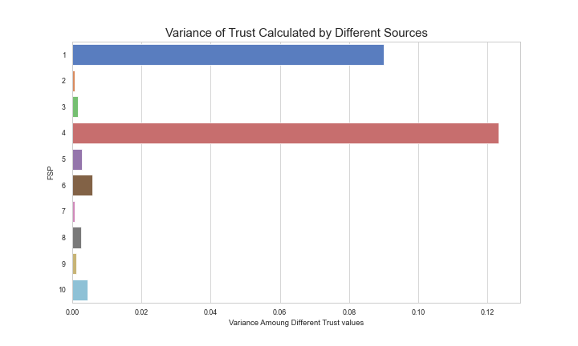
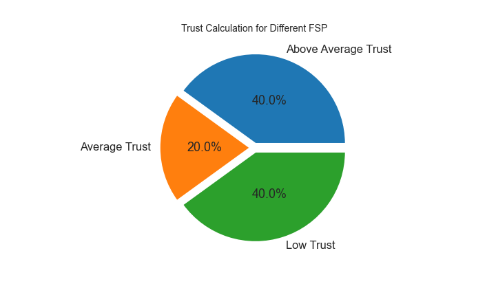

# graphs_fog_data_analysis
This small code contains python code for developing histograms with multiple variables and pie charts using packages like matplotlib and seaborn. whenever I need to make graphs for my research paper experiments results, I often use this code to draw graphs which itself conculdes the results.

Output of graphs are:

